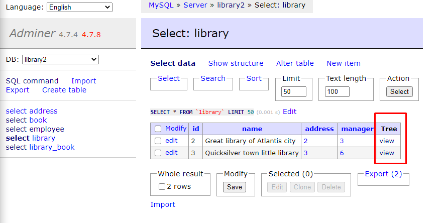
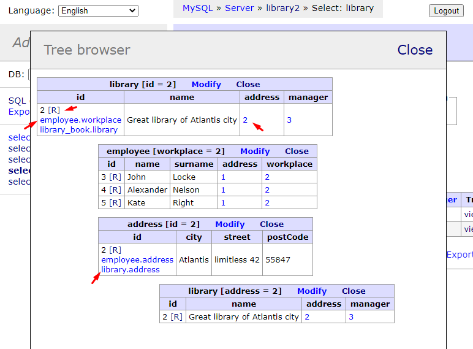

# adminer-tree-view

Adds posibility to display related rows from different tables in one page

# installation

This plugin consist of two files, both placed in **dist/** folder. 
 * Place file **script.js** someplace with url accesibble accessible to your Adminer.
 * Place file **AdminerTreeViewer.php** near your adminer PHP file.
 * Download current version of **plugin.php** from official Adminer GitHub: https://github.com/vrana/adminer/blob/master/plugins/plugin.php 
   and place it also near your adminer PHP file.
 * Create configuration to load plugin accorting to demo in **/demo/index.php** (see https://www.adminer.org/en/plugins/#use for official tutorial on plugins use)
   * Include **plugin.php** and **AdminerTreeViewer.php** into your configuration
   * Add instance of ```AdminerTreeViewer``` into ```$plugins``` array
   * Pass url to JS file as parameter to ```AdminerTreeViewer``` constructor

# usage

This plugin will add new column to your tables with data:



After clicking on **Tree** link, modal window will be opened where you can start browsing related data via foreign keys:


